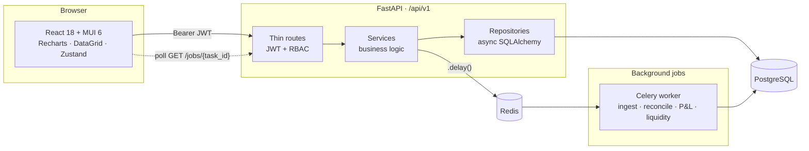

<div align="center">

# 💠 FinRecon

### Financial Data Reconciliation & Reporting System

**Ingest ledger transactions → reconcile ledgers against each other → generate P&L and
liquidity reports — triggered and monitored from a real-time dashboard.**

[](#)
[](#)
[](#)
[](#)
[](#)
[](#)
[](#)
[](#)
[](#verification)

*FastAPI + Celery backend · React 18 + MUI 6 glassmorphic dashboard · Docker Compose stack*

</div>

---

## Table of contents

- [Architecture](#architecture)
- [Features](#features)
- [Tech stack](#tech-stack)
- [Getting started](#getting-started)
  - [Docker Compose](#docker-compose-closest-to-production)
  - [Local development](#local-development)
  - [Verification](#verification)
- [API overview](#api-overview)
- [Demo data](#demo-data)
- [Project structure](#project-structure)

---

## Architecture



The dashboard triggers jobs over HTTP, the worker executes them against Postgres, and the
UI polls task status until each job lands on the record it produced.

---

## Features

### 🔍 Reconciliation
- Deterministic matching engine over amount, date, and reference — pure functions, no DB coupling, unit tested
- Runs persisted with per-line audit items classified `matched` / `only_left` / `only_right`
- Run detail view with match-ratio donut, mismatch distribution, and a timeline
- CSV export of exception lines

### 📊 Reporting
- **P&L** — revenue, COGS, gross profit, operating expenses, operating income, net income, net margin
- **Liquidity** — current / quick / cash ratios and working capital, as of a balance-sheet date
- Idempotent background generation: re-running a period returns the existing report rather than duplicating it
- Structured detail payloads (`summary` / `timeseries` / `breakdown`) that drive the charts directly

### ⚙️ Operations
- HTTP endpoints to trigger every background job — no shell access required
- **Operations page**: pick ledgers and a period, queue a job, watch it poll to completion, click straight through to the record it produced
- Per-tab job history of the last 10 tasks, auto-refreshed while any task is non-terminal
- Transaction ingest with a ledger picker, JSON formatter, and client-side validation that mirrors the server schema

### 🛡️ Platform
- JWT auth with three roles (`admin`, `accountant`, `viewer`) enforced on every route
- Idempotent ingest — unique `(ledger_id, external_id)` with `ON CONFLICT DO NOTHING`
- Temporal audit fields (`created_at` / `updated_at`) on transactions, reports, and runs
- Deterministic demo data so the dashboard is presentable against an empty database
- Light / dark themes persisted per browser; vendor-split bundle (app chunk ~115 kB)
- Charts carry screen-reader summaries; status is never conveyed by colour alone

---

## Tech stack

| Layer | Technology | Notes |
|-------|-----------|-------|
| API | FastAPI, Pydantic v2 | Thin routes; logic lives in services |
| ORM | SQLAlchemy 2.0 (async) + asyncpg | Alembic for migrations |
| Database | PostgreSQL 16 | |
| Jobs | Celery + Redis | Ingest, reconcile, P&L, liquidity |
| Data | pandas | Transaction normalisation in the reconcile task |
| Auth | PyJWT + bcrypt | HS256, bcrypt cost 12 |
| UI | React 18, TypeScript, Vite 5 | `strict`, `exactOptionalPropertyTypes`, `noUncheckedIndexedAccess` |
| Components | MUI 6, MUI X DataGrid 7 | Shared library in `frontend/src/components/ui/` |
| Charts | Recharts 2 | Accessible `ChartFrame` wrapper with spoken data summaries |
| Motion | Framer Motion | Design-token-aligned primitives in `frontend/src/lib/animations.ts` |
| State | Zustand | Auth, theme, demo mode |
| Tests | pytest + httpx | 37 passing; 14 DB-dependent integration tests skip without Postgres |
| Deploy | Docker Compose | Postgres, Redis, API, worker, frontend |

---

## Getting started

### Docker Compose (closest to production)

Brings up Postgres, Redis, the API, a Celery worker, and the built frontend. The API
container runs `alembic upgrade head` on start, so migrations apply themselves.

```powershell
# PowerShell
$env:POSTGRES_PASSWORD="change-me"
$env:JWT_SECRET_KEY="your-secret-key-min-32-chars"
docker compose up -d --build
```

```bash
# Bash
POSTGRES_PASSWORD=change-me JWT_SECRET_KEY=your-secret-key-min-32-chars \
  docker compose up -d --build
```

Create your first user (there is no public sign-up):

```bash
docker compose exec api python scripts/create_user.py \
  --email admin@company.com --password "ChangeMe123!" --role admin
```

Open the frontend at `http://localhost` (or `http://localhost:$FRONTEND_PORT`).

### Local development

Four processes: Postgres/Redis, the API, the worker, and Vite.

```bash
# 1. Backend deps
python -m venv .venv
.venv\Scripts\activate          # Windows;  source .venv/bin/activate on Unix
pip install -r requirements.txt

# 2. Configure — copy .env.example to .env and set DATABASE_URL + JWT_SECRET_KEY
alembic upgrade head
python scripts/create_user.py --email admin@company.com --password "ChangeMe123!" --role admin

# 3. API           → http://127.0.0.1:8000  (docs at /docs)
uvicorn app.main:app --reload

# 4. Worker (needs Redis) — without this, jobs stay "queued" forever
celery -A app.workers.celery_app worker -l info

# 5. Frontend      → http://localhost:5173
cd frontend && npm install && npm run dev
```

> **⚠️ `VITE_API_BASE_URL` must be an origin only.** Vite already proxies `/api` →
> `http://127.0.0.1:8000` in dev, so you usually don't need it at all. If you do set it,
> the client appends `/api/v1/...` itself — including that suffix produces
> `/api/v1/api/v1/...` and 404s.

### Verification

```bash
pytest tests -q                          # 37 passed, 14 skipped (integration needs Postgres)
cd frontend && npm run typecheck         # tsc --noEmit
cd frontend && npm run build             # production bundle, vendor-split chunks
```

---

## API overview

Base prefix `/api/v1`. All routes except `/health` and `/auth/login` require
`Authorization: Bearer <token>`.

| Area | Endpoints | Roles |
|------|-----------|-------|
| Auth | `POST /auth/login`, `GET /auth/me` | public / any |
| Ledgers | `GET /ledgers`, `GET /ledgers/{id}` | any |
| | `POST /ledgers`, `PATCH /ledgers/{id}` | admin |
| Jobs | `POST /jobs/reconciliation`, `POST /jobs/reports/pnl`, `POST /jobs/reports/liquidity` | admin, accountant |
| | `GET /jobs/{task_id}` | any |
| Transactions | `POST /transactions/ingest` | admin, accountant |
| Reconciliations | `GET /reconciliations`, `GET /reconciliations/{id}`, `GET /reconciliations/{id}/items` | any |
| Reports | `GET /reports`, `GET /reports/overview`, `GET /reports/{id}` | any |

Reporting routes are also aliased under `/reporting/...`.

**Response shapes** — collections are `{ items, total, meta }`; details are
`{ id, data: { summary, timeseries, breakdown }, meta }`. When a payload is synthetic,
`meta.is_demo` is `true` — it lives inside `meta`, not at the top level.

See [docs/DEVELOPER_WALKTHROUGH.md](docs/DEVELOPER_WALKTHROUGH.md) for request/response
detail, service boundaries, and the demo-data policy.

---

## Demo data

With `REPORTING_DEMO_FALLBACK=true` (the default in `.env.example`), list endpoints
return deterministic synthetic rows when the database is empty, and the dashboard shows
an app-wide **Demo Mode** banner.

Detail endpoints resolve those same `uuid5` ids **even when the flag is off**, so a link
from a list never 404s mid-flip. That means `REPORTING_DEMO_FALLBACK=false` is not a
complete "no synthetic data reachable" switch — the reasoning is documented on
`ReportService` and `ReconciliationService`.

The Docker Compose stack runs with `APP_ENV=production` and therefore defaults
`REPORTING_DEMO_FALLBACK` to **false**. Set it to `true` in your environment before
`docker compose up` if you want to demo against an empty database.

---

## Project structure

```
app/                      FastAPI backend
├── api/routes/           auth, ledgers, jobs, transactions, reporting
├── core/                 config, security, logging
├── database/             async session factory
├── models/               SQLAlchemy ORM
├── repositories/         read-side SQL
├── schemas/              Pydantic request/response
├── services/             business logic, demo data, payload builders
└── workers/              Celery app + tasks

frontend/src/
├── app/                  router, layout, global state (auth/theme/demo)
├── components/ui/        shared component library
├── components/charts/    Recharts helpers (tooltip, accessible frame)
├── features/             auth, dashboard, operations, reconciliation, reports, transactions
├── hooks/                useReports, useLedgers, useJobHistory, …
├── theme/                design tokens, light/dark themes, glass utility
├── lib/                  animation primitives
└── types/                API contracts

alembic/                  migrations
tests/                    unit + integration (pytest)
docs/                     developer walkthrough
```

---

<div align="center">

**License:** Proprietary

</div>
